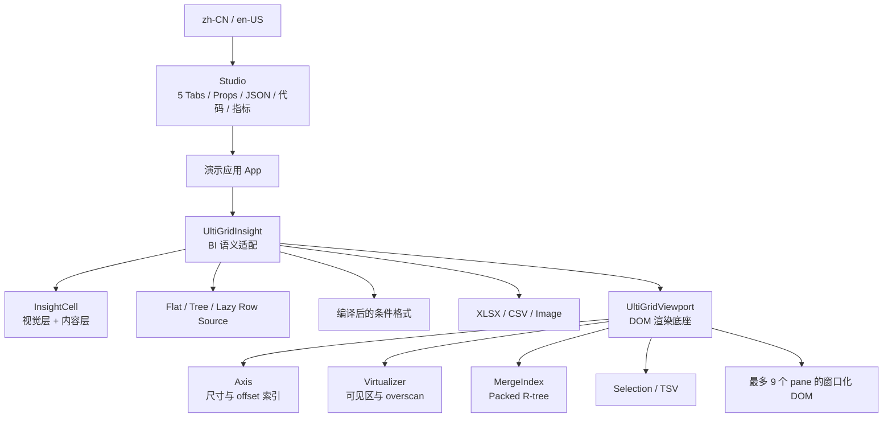
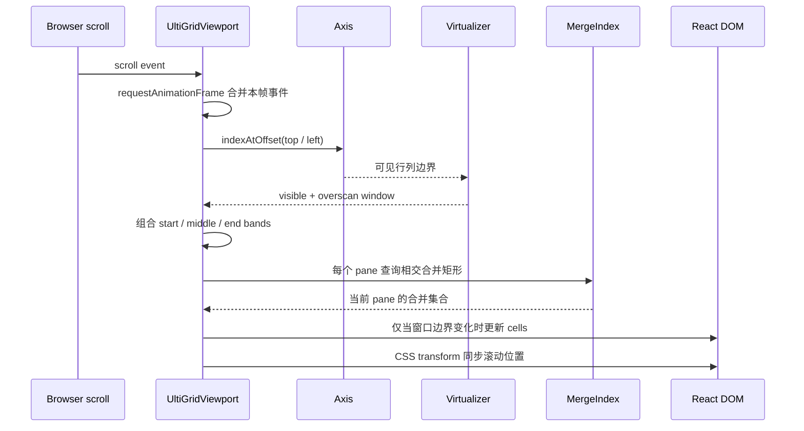

# UltiGrid 架构

本文描述当前仓库已经落地的结构、热路径、复杂度和边界。它是实现说明，不是尚未完成能力的设计愿望。

## 1. 设计目标与非目标

核心目标是让 React DOM 表格的计算与 DOM 规模接近当前窗口，而不是完整二维矩阵，并保持渲染层与 BI 业务层解耦。

当前设计坚持：

- **按坐标取值**：底层只知道行数、列数和 `getCell`，不持有二维数据副本。
- **轴与内容分离**：尺寸和坐标由 `Axis` 管理，单元格内容由调用方提供。
- **二维窗口化**：行列同时裁剪，固定区由独立 pane 组合。
- **稀疏业务状态**：自定义尺寸、合并区域、行 id、formatter 缓存使用 `Map` 或空间索引。
- **分层渲染**：`core` 不理解条件格式、树形行、图片或导出；这些能力由 `bi` 适配。
- **可控物化**：可见窗口按需物化；复制和导出等必须物化的操作提供范围或安全上限。

当前非目标包括数据请求协议、服务端查询、排序筛选引擎、透视计算、编辑事务、协同状态和无限画布坐标重基。这些能力可以围绕渲染底座扩展，但不应进入核心热路径。

## 2. 分层总览



### `src/core`

- `UltiGridViewport.tsx`：组件编排、滚动同步、pane、单元格 surface、选择、自动测量和 API。
- `axis.ts`：默认尺寸 + 稀疏覆盖 + typed segment tree。
- `virtualizer.ts`：用 offset 反查可见索引，加入 overscan。
- `mergeIndex.ts`：合并矩形的 id `Map` 和延迟构建 packed R-tree。
- `selection.ts`：选区规范化、导航、范围遍历、TSV 编解码。
- `viewportTypes.ts`：业务无关的公开 Props 与上下文类型。

### `src/bi`

- `UltiGridInsight.tsx`：把行模型和列定义投影成 `UltiGridViewport` 坐标。
- `InsightCell.tsx`：稳定的应用单元格 DOM 层级，使用 `React.memo`。
- `conditionalFormatting.ts`：规则编译与无规则数组分配的逐格求值。
- `rowModel.ts`：平铺模型与增量扁平化树模型。
- `excelExport.ts` / `imageExport.ts`：按需动态加载的导出实现。

### `src/studio` 与 `src/demo`

Studio 是能力演示和参数实验台，不是核心依赖。它提供一个能力总览和四个差异化数据场景（经营分析、树形钻取、条件矩阵、合并画布），每个 Tab 都能打开并复制使用公开 npm 入口的 TSX。Demo 使用确定性函数按坐标生成值，并限制行、列缓存，避免为了展示 10 万规模而预先创建完整对象集合。

Studio 的语言开关由 `src/i18n` 提供完整 `zh-CN` / `en-US` 字典；全屏优先只对预览 stage 调用原生 Fullscreen API 并监听 `fullscreenchange`，权限策略拒绝时退回同一 stage 的固定定位兼容模式。性能 HUD 是页面级 rAF cadence 观察器，不进入 `core` 或 `bi` 包。

### `packages/core` 与 `packages/insight`

两个目录是 ESM-only 的发布边界：`@ultigrid/core` 根入口只公开 `UltiGridViewport` 与组件契约类型；`@ultigrid/insight` 公开应用组件、列 builder、行模型与条件规则类型，并把 core 作为 dependency。每个包仅开放 `.` 与 `./style.css`。Insight 的样式产物自包含 core CSS，包契约脚本会检查 JS、声明、README/LICENSE、依赖 chunk 和 CSS 内容。

## 3. 坐标约定

核心 API 统一使用：

- 零基坐标；
- `rowStart`、`rowEnd`、`columnStart`、`columnEnd` 均为闭区间；
- 合并区域的锚点是左上角；默认内容和复制文本从锚点单元格读取。

`UltiGridInsight` 会添加应用 chrome：

- `showHeader=true` 时，底层网格第 0 行是表头，数据行整体下移 1；
- `showRowNumbers=true` 时，底层网格第 0 列是行号，数据列整体右移 1；
- 数据合并区域传入时使用数据坐标，组件内部会加上述偏移；
- `selection`、`onSelectionChange`、`onViewportChange`、`scrollToCell`、`getSelection`、复制与 `InsightExportRange` 都使用数据坐标，不含表头和行号；
- 与 core 交互时，Insight 在边界统一做数据坐标 ↔ viewport 坐标转换。

调用方应为行和列提供稳定、唯一的业务 id；索引只表示当前展示顺序。

## 4. 滚动与窗口化热路径



滚动事件先通过 `requestAnimationFrame` 合并。每帧仍会更新 CSS 变量 `--ultigrid-scroll-x/y`；只有可见索引窗口发生变化时才替换 React window state。pane 中的单元格使用绝对定位和 `translate3d`，viewport 和 pane 使用 `contain` 限制布局/绘制影响范围。

### pane 模型

每条轴最多有三个 band：

- `start`：顶部或左侧固定区；
- `middle`：滚动且窗口化的中心区；
- `end`：底部或右侧固定区。

行列 band 做笛卡尔积，最多形成 9 个 pane。pane 负责裁剪，内部 cells 容器负责滚动 transform。合并区域跨越 pane 时，会在每个相交 pane 内创建一个被裁剪的 surface；只有包含锚点（或首个可见 fragment）的 owner pane 执行自定义 renderer，其余 fragment 使用静态文本并从可访问性树隐藏，避免 stateful 组件重复 effect 和状态分叉。

固定 band 不做滚动窗口化，但会先按 viewport 像素预算约束实际固定数量，避免请求的四侧固定区超出容器后重叠。因此 DOM 数量可近似理解为：

```text
(窗口行 + overscan 行 + 上下固定行)
×
(窗口列 + overscan 列 + 左右固定列)
```

合并区域会替换其覆盖的普通单元格；跨 pane 的合并 surface 可能产生少量重复。

## 5. Axis：尺寸、offset 与容器平铺

`Axis` 为每条轴保存：

- 一个默认尺寸；
- `Map<index, customSize>` 稀疏覆盖；
- 一棵 `Float64Array` 线段树，保存自定义尺寸相对默认尺寸的 delta；
- 可选容器尺寸和 `stretch` 状态。

线段树容量是大于等于 `count` 的最小 2 次幂。主要操作：

- `getSize(index)`：`O(1)`；
- `getOffset(index)`：`O(log N)`；
- `indexAtOffset(offset)`：`O(log N)`；
- `setSize(index, size)`：`O(log N)`；
- 构建/重建：`O(P + K)`，`P` 为线段树容量，`K` 为自定义项数。

`fitColumns="stretch"` 只在自然总宽小于容器时，把剩余宽度平均加到每一列；自然总宽较大时保持原宽并横向滚动。

### 尺寸 Props 的成本差异

`rowHeights` / `columnWidths` 只遍历实际 `Map` 项，适合稀疏大规模覆盖。`getRowHeight` / `getColumnWidth` 为了构造轴，会在轴重建时从 `0` 遍历到 `count - 1`。10 万规模可以使用，但如果尺寸经常变化，优先传稳定的 `ReadonlyMap`。

### 自动测量

`autoSize` 查询当前 viewport 中已渲染且非合并的 cell，读取 `scrollWidth/Height` 与 `clientWidth/Height`，然后更新轴尺寸。默认只增大、不缩小，以减少滚动位置振荡。

它不是全数据内容宽度/高度的精确预扫描：未滚动到的内容不会参与测量。测量缓存会随访问过的行列增加，并带来同步布局读取，因此大规模压力场景默认应关闭或只开必要轴。默认公式以已有尺寸加 overflow 为基础、只增大；`allowShrink` 会临时读取内在尺寸，成本更高。切换外部数据集时应更新 `contentVersion`，组件会清空旧测量并恢复配置尺寸后重新测量。

## 6. MergeIndex：合并区域模型

每个合并区域保存为一个矩形：

```ts
{
  id: 'wide',
  rowStart: 0,
  rowEnd: 0,
  columnStart: 0,
  columnEnd: 10_500,
}
```

即使跨 10,501 列，也只占一个 region，而不是 10,501 条覆盖记录。相同表示也适用于纵跨 10,499 行的压力区域。`MergeIndex` 使用：

- `Map<string, MergeRegion>`：稳定 id 查询和变更；
- packed R-tree：二维点查询与矩形相交查询；
- dirty 标记：批量变更后，在下一次空间查询时一次性构建树。

当前 STR 风格 bulk build 主要由排序主导，约 `O(M log M)`；查询在分布良好时接近 `O(log M + K)`，`K` 为结果数，但空间索引不能消除退化分布的最坏 `O(M + K)`。

`UltiGridViewport` 接收不可变数组式 Props，并在数组身份或表格边界变化时创建新索引。应使用 `useMemo` 保持 `mergedCells` 引用稳定。当前不会拒绝相互重叠的合并矩形；调用方应提供无重叠集合，否则覆盖判定、选择和视觉层级可能不符合预期。

## 7. 选择、导航与复制

选区只保存一个闭区间矩形，所以常驻状态为 `O(1)`：

- pointer down 创建锚点；
- pointer enter 在拖拽时扩展范围；
- Shift 保持初始锚点；
- 方向键、Tab、Enter 计算下一个坐标；
- 从合并区域内移动时会跳过整个合并区域，并落在目标合并区域的左上角。

复制不是窗口化操作。`rangeToTSV` 会逐格调用 `getCell` 并生成完整字符串，时间和额外内存均为 `O(A)`，`A` 为选区单元格数。`UltiGridViewport` 默认 `copyCellLimit=100_000`；业务层可降低该值或改为服务端导出。

组件内部保留独立的 anchor/focus，因此反向拖选和 Shift+方向键可以正确收缩。调用方动态缩小 `rowCount` 或 `columnCount` 时，非受控选区会自动夹取并回调；受控值在渲染、复制和命令式 API 中也会使用夹取后的安全范围。

## 8. UltiGridInsight 数据适配

### 行来源

优先级为：

1. `rowModel`；
2. `rowSource`；
3. `rows`。

`rows` 最简单，但内存由调用方完整承担。`LazyRowSource` 只需要 `rowCount` 和同步 `getRow(index)`，适合外部分页缓存、列式数据或坐标生成；协议本身没有 async、prefetch、abort 或 subscribe。`UltiGridInsight` 为当前工作集维护最多 512 项的行与行元数据缓存，远端数据适配器仍应先使用调用方自己的分页缓存。`FlatRowModel` 提供稳定订阅和按需 id 索引。`TreeRowModel` 维护当前可见节点数组，子节点在第一次展开时同步或异步物化，展开/折叠原地更新可见数组。

树模型的节点 id `Map` 查询是 `O(1)`；`findRowIndex` 和部分展开/折叠操作使用可见数组搜索或搬移，最坏为 `O(V)`，其中 `V` 是当前可见树节点数。它不是为每次变更都保证对数复杂度的树序列结构。

`UltiGridInsight` 通过 `onToggleRow` 把树按钮事件交还调用方；使用 `TreeRowModel` 时应在回调中调用 `toggle` / `expand` / `collapse`。当前 Studio 的 tree 演示使用惰性可见性索引；折叠根节点会从行数和坐标映射中真实移除后代，而不需要预建 10 万行对象。正式业务仍推荐 `TreeRowModel`，以获得异步加载、订阅和错误状态。

### 列来源与缓存

列可以通过 `columns` 数组提供，也可以使用 `columnCount + getColumn(index)` 惰性生成。惰性列缓存在 `Map` 中，当前上限为 2,048 项，按最旧插入项淘汰。formatter 以列对象为弱键缓存，列被 LRU 淘汰后不会被 formatter 缓存阻止回收。

如果调用方直接创建 100,000 个 `InsightColumn` 对象，虚拟化无法回收这些调用方对象；极宽表应使用惰性列 getter，并保证同一索引的列 id 和语义稳定。`InsightColumn.width` 会从显式 `columns` 数组收集；使用惰性 `getColumn` 时，自定义宽度应放在 `columnWidths` 中，或显式传 `getColumnWidth`（会在轴构建时遍历逻辑列）。

### 条件格式

规则在 Props 变化时编译、排序一次：

- 文字样式；
- 背景色；
- 图标；
- 2/3 色数值色阶；
- 带正负轴的数据条。

色阶预计算 256 项 palette。每个可见数据单元格的求值成本约为 `O(R)`，`R` 为该列的全局规则与列规则数；`stopIfTrue` 可提前结束。规则应保持小而稳定，昂贵的 `custom` predicate 仍会占用主线程。

## 9. 单元格 DOM 合约

核心层结构保持简单：

```text
.ultigrid-cell[role=gridcell]
└── .ultigrid-cell__content
    └── renderCell(...) 的结果
```

应用层嵌入 `InsightCell` 后：

```text
.ultigrid-cell
└── .ultigrid-cell__content
    └── .ultigrid-insight-cell
        ├── .ultigrid-insight-cell__visual-layer       # 可选；背景图片、数据条
        │   ├── .ultigrid-insight-cell__data-bar
        │   └── .ultigrid-insight-cell__background-image
        └── .ultigrid-insight-cell__content-layer      # flex 对齐与 padding
            ├── leading image / icon
            ├── .ultigrid-insight-cell__value          # 文本、renderContent 或组件
            └── trailing icon / image
```

视觉层 `pointer-events: none`，避免装饰内容干扰选择；内容层独立负责文字、媒体与自定义 React 内容。默认是单行省略，`visualStyle.wrap` 才开启换行。自定义组件应尽量保持浅 DOM、稳定 Props，并避免在 render 中同步做网络、图片解码或大计算。

## 10. 导出模型

### Excel

Excel 编码使用 `write-excel-file`，只在触发导出时动态加载。实现按导出范围构建单元格矩阵，再生成 OOXML Blob：

- 时间和峰值内存：`O(A)`；
- 支持表头、列宽、树形缩进和合并范围；
- `InsightColumn.exportValue` 用于把自定义视图内容转换为业务值；
- 列宽按 `columnWidths` Map、`InsightColumn.width`、默认宽度解析；
- 单工作表最多 16,384 列；含表头最多 1,048,576 行，组件在导出前校验。

10 万列逻辑表不能一次导出为一个 Excel 工作表。应传 `InsightExportRange` 分片，或在后端生成多 sheet/其他格式。

### CSV

CSV 当前在主线程生成字符串 chunks 并合并为一个 Blob，仍是 `O(A)` 峰值内存。Excel/CSV 共用默认 1,000,000 单元格硬上限，并优先使用列的 `exportValue`。极大范围应显式传小范围，或放到 Worker / 服务端。

### 图片

图片导出使用 `html-to-image` 捕获传入的 table shell。由于表格本身窗口化，默认结果是当前已布局视口，不是逻辑整表。整表长图需要滚动分片、离屏拼接和像素上限控制，当前尚未实现。

## 11. 复杂度汇总

记：

- `Nᵣ` / `N𝚌`：逻辑行列数；
- `Kᵣ` / `K𝚌`：自定义尺寸数量；
- `W`：所有 pane 当前需要检查的窗口格点数；
- `M`：合并区域总数；
- `I`：当前 pane 相交合并区域数；
- `A`：复制或导出的目标单元格数。

| 操作 | 时间复杂度 | 额外内存 | 备注 |
| --- | --- | --- | --- |
| Axis 构建 | `O(P + K)` | `O(P + K)` | `P` 为下一 2 次幂容量 |
| offset / offset→index | `O(log N)` | `O(1)` | 行列各执行 |
| 可见窗口计算 | `O(log Nᵣ + log N𝚌)` | `O(1)` | 不含 React 渲染 |
| 普通窗口 surface | 约 `O(W)` | `O(W)` DOM/React 节点 | 固定区会放大 `W` |
| MergeIndex 首次构建 | 约 `O(M log M)` | `O(M)` | Props 变化后下次查询触发 |
| MergeIndex 查询 | 常见 `O(log M + I)`，最坏 `O(M + I)` | `O(I)` | 分布相关 |
| 条件格式 | `O(W × R)` | 每格一个结果对象 | `R` 为规则数，可提前终止 |
| 复制 / Excel / CSV | `O(A)` | `O(A)` | 不受视口虚拟化保护 |

在 pane 渲染中，为跳过被合并区域覆盖的普通格点，当前实现还会按相交 merge 做行覆盖检查。大量重叠或同一行高密度 merge 会增加常数甚至退化；无重叠、稀疏矩形是主要优化场景。

## 12. 内存模型

### 不随完整矩阵面积增长的部分

- 不保存 `Nᵣ × N𝚌` 单元格数组；
- DOM/React cell 主要随窗口 `W` 增长；
- 选区只保存一个矩形；
- 横跨或纵跨 10,000+ 单元格的单个 merge 仍是一条矩形记录。

### 随轴长度增长的部分

`Axis` 的 typed segment tree 是 `O(N)`，并非只占可见窗口内存。以 100,000 项为例，容量为 131,072，单轴 `Float64Array` 有 262,144 项，原始 buffer 约 2 MiB；行列两轴约 4 MiB。这个数字不包含 JS 对象、React、DOM、浏览器内部结构和 `Map` 开销。

### 随业务数据增长的部分

- 自定义尺寸 `Map`：`O(Kᵣ + K𝚌)`；
- 自动测量缓存：最坏可随滚动访问过的行列增长到 `O(Nᵣ + N𝚌)`；
- 合并区域和空间树：`O(M)`；
- `columns` / `rows` 数组：由调用方承担完整长度；
- 惰性列缓存：最多 2,048 列；formatter 使用 `WeakMap`；
- UltiGridInsight 行与元数据缓存各最多 512 项；调用方仍负责远端分页缓存。

## 13. 10 万 × 10 万的诚实边界

当前实现可以把 `rowCount=100_000`、`columnCount=100_000` 传给轴和窗口化系统，并只按当前窗口调用 cell getter。这验证的是**架构没有 100 亿次初始化循环或 100 亿节点 DOM**，不是所有业务场景的性能认证。

默认尺寸下：

```text
width  = 100,000 × 136px = 13,600,000px
height = 100,000 × 34px  =  3,400,000px
```

当前没有分段滚动/坐标重基，因此超大画布仍受浏览器的最大布局尺寸、滚动精度和缩放行为限制。这些限制会因浏览器引擎、版本和设备而变化。

横跨 10,000+ 列或纵跨 10,000+ 行的合并区域解决的是“合并表示和查询不能逐格展开”问题：矩形索引和尺寸计算不会创建 10,000 个 DOM cell。当前 Demo 在 100,000 × 100,000 下分别验证横跨 10,501 列和纵跨 10,499 行的独立矩形。它不消除其他可见单元格、相交查询、自定义内容、固定区和浏览器绘制成本。

仓库没有提交标准化 benchmark 结果，因而不声明“稳定 60 FPS”或类似数字。Studio 采样的是整个页面的 `requestAnimationFrame` 回调间隔：HUD 用中位数换算 cadence（Hz），显示帧间隔 P95，并把 viewport 回调给出的可见范围与渲染 cell 数放在旁边。它不是表格自身 FPS，也不能把页面其他工作与表格渲染分离；这些会话观测仍不等于正式 benchmark。正式性能结论需要：

- 锁定浏览器版本、设备、窗口大小和缩放；
- 锁定数据 getter、合并分布、尺寸覆盖、固定区和 overscan；
- 区分首次建索引、冷启动、稳态滚动和方向突变；
- 记录长任务、提交时间、内存和掉帧分位数，而非只看平均 FPS。

## 14. 性能使用准则

1. 为 `getCell`、`getColumn`、尺寸 `Map`、合并数组和 renderer 保持稳定引用。
2. `getCell` 应是近似 `O(1)` 的同步函数；网络数据先进入外部缓存。
3. 10 万列使用惰性 `getColumn`，不要预建 10 万个 React header。
4. 大规模自定义尺寸使用 `ReadonlyMap`，避免频繁触发全轴 getter 扫描。
5. 固定区保持小；先从较低 overscan 开始，再按快速滚动白屏情况调高。
6. 压力场景关闭 `autoSize`；需要换行时优先限定最大行高。
7. 条件规则预先给出显式 domain，避免为了求 min/max 扫描全数据。
8. 自定义 cell 使用浅 DOM、memo 化组件和异步图片加载。
9. 复制和导出必须限制范围；完整大数据导出移到 Worker/后端。
10. 合并区域使用稳定 id、无重叠集合和 memo 化数组。

## 15. 测试与演进约束

当前测试覆盖 Axis、virtualizer、MergeIndex、selection/TSV、条件格式、BI 行模型、Insight 数据坐标、公共类型、四个差异场景、双向万级合并和中英文翻译。包构建后还会验证发布 exports、声明边界与自包含 CSS。架构演进应至少维持：

- 坐标边界和零长度轴行为；
- 小数像素下 `indexAtOffset(getOffset(i)) === i`；
- 合并 query 与点查询正确性；
- 大选区复制安全上限；
- 树模型展开、折叠、异步加载和错误状态；
- 条件规则顺序、色阶和数据条；
- Insight 表头/行号开启时，所有公共选择、viewport 和命令式 API 仍保持数据坐标；
- `@ultigrid/core` / `@ultigrid/insight` 的公开根类型与 `./style.css` 合约；
- `npm run build` 的严格 TypeScript 检查。

建议后续补充浏览器集成测试、滚动截图回归、固定 pane + merge 组合矩阵、可访问性扫描和可复现的性能基准套件。
